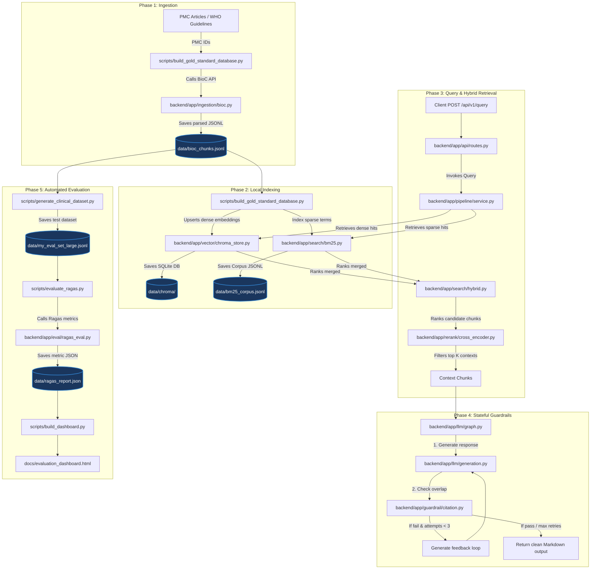

# X-CDS: Explainable Clinical Decision Support System

X-CDS is a state-of-the-art Clinical Decision Support System designed to assist medical practitioners by retrieving and synthesizing clinical literature with mathematically guaranteed factual grounding. 

By integrating a stateful self-correction agentic loop, X-CDS addresses the core challenge of large language model (LLM) hallucinations in critical medical environments.

## Core Features & Architecture

*   **Hybrid Ingestion & Retrieval:** Merges dense semantic embeddings (ChromaDB + `text-embedding-004`) with sparse lexical search (BM25) using Reciprocal Rank Fusion (RRF).
*   **Neural Re-ranking:** Prioritizes retrieved passages using a Cross-Encoder (`ms-marco-MiniLM-L-6-v2`) to maximize context precision.
*   **Stateful Agentic Guardrails (LangGraph):** Orchestrates a multi-turn evaluation loop that programmatically cross-references generated answers against source literature, retrying automatically if a citation cannot be strictly verified.
*   **Explainable UI:** Displays medical responses with inline interactive citations mapped directly to source evidence chunks.

## Tech Stack
*   **Backend:** FastAPI, Python 3.11, LangChain, LangGraph
*   **Frontend:** React, TypeScript, TailwindCSS, Vite
*   **Database:** Chroma Vector Store
*   **LLMs:** Google Cloud Vertex AI (Gemini 2.5 Pro & 3.5 Flash)


## System Architecture & Data Flows

### A. Global Pipeline Flowchart (Non-Linear)

This flowchart illustrates how data and control pass between your python scripts and local directories across all phases of the project:



### B. Chronological Pipeline Guide (Linear Flow)

This flowchart maps the entire runtime process step-by-step:

```mermaid
graph TD
    Step1[1. Ingest Literature:<br>build_gold_standard_database.py pulls PMC API reviews] -->
    Step2[2. Persist Raw Text:<br>Parsed chunks saved to data/bioc_chunks.jsonl] -->
    Step3[3. Build Dense Index:<br>chroma_store.py embeds text via bge-small-en-v1.5] -->
    Step4[4. Build Sparse Index:<br>bm25.py creates corpus index at data/bm25_corpus.jsonl] -->
    Step5[5. Receive Client Query:<br>POST request hits routes.py and invokes service.py] -->
    Step6[6. Fetch Chunks:<br>Dense search + BM25 search merged via hybrid.py RRF] -->
    Step7[7. Re-rank Contexts:<br>cross_encoder.py filters top K relevant passages] -->
    Step8[8. LLM Generation:<br>generation.py queries gemini-3.5-flash in graph.py] -->
    Step9[9. Citation Check:<br>citation.py calculates verbatim token overlap >= 25%] -->
    Step10[10. Stateful Retries:<br>Incorrect claims trigger graph feedback loops up to 3 times] -->
    Step11[11. Return Final Response:<br>Explainable answer returned to FastAPI & React UI] -->
    Step12[12. Build Test Dataset:<br>generate_clinical_dataset.py synthesizes 100 cases] -->
    Step13[13. Run Benchmarks:<br>evaluate_ragas.py scores pipeline metrics via gemini-2.5-pro] -->
    Step14[14. Compile Dashboard:<br>build_dashboard.py compiles docs/evaluation_dashboard.html]

    style Step1 fill:#f9f,stroke:#333,stroke-width:2px
    style Step4 fill:#bbf,stroke:#333,stroke-width:2px
    style Step5 fill:#dfd,stroke:#333,stroke-width:2px
    style Step8 fill:#fdd,stroke:#333,stroke-width:2px
    style Step11 fill:#dfd,stroke:#333,stroke-width:2px
    style Step12 fill:#ffd,stroke:#333,stroke-width:2px
```



### C. Details of the 5 Phases

1.  **Ingestion & Structuring:** Triggers raw clinical PDF/XML fetching from the NIH PMC API using [build_gold_standard_database.py](file:///d:/X-CDS/scripts/build_gold_standard_database.py). Normalizes text blocks and WHO/PAHO guidelines, exporting them to [bioc_chunks.jsonl](file:///d:/X-CDS/data/bioc_chunks.jsonl).
2.  **Dual-Channel Local Indexing:**
    *   *Dense Search:* Text is embedded using the `BAAI/bge-small-en-v1.5` model in [embeddings.py](file:///d:/X-CDS/backend/app/vector/embeddings.py) and indexed in Chroma DB [chroma_store.py](file:///d:/X-CDS/backend/app/vector/chroma_store.py).
    *   *Sparse Search:* Terms are indexed using BM25 in [bm25.py](file:///d:/X-CDS/backend/app/search/bm25.py) to catch exact drugs/genes.
3.  **Hybrid Query & Re-ranking:** Merges vector cosine similarities and lexical rankings in [hybrid.py](file:///d:/X-CDS/backend/app/search/hybrid.py) via Reciprocal Rank Fusion (RRF). Filters the top contexts using a Cross-Encoder (`ms-marco-MiniLM-L-6-v2`) in [cross_encoder.py](file:///d:/X-CDS/backend/app/rerank/cross_encoder.py).
4.  **Stateful LangGraph Guardrail:** Directs the response generation in [graph.py](file:///d:/X-CDS/backend/app/llm/graph.py). The guardrail checks that every cited sentence has a minimum verbatim token overlap ($T_{min} = 0.25$) with the referenced text in [validator.py](file:///d:/X-CDS/backend/app/guardrail/validator.py). Failures trigger feedback retries.
5.  **Automated Ragas Evaluation:** Synthesizes clinical test cases using [generate_clinical_dataset.py](file:///d:/X-CDS/scripts/generate_clinical_dataset.py) and grades them in [ragas_eval.py](file:///d:/X-CDS/backend/app/eval/ragas_eval.py) using Gemini 2.5 Pro as the judge.

## Prerequisites

- Python 3.11+
- Node.js 20+ (for local frontend dev)
- Docker + Docker Compose (optional, recommended for one-command startup)
- A Google Gemini API key (`GOOGLE_API_KEY`) for live generation

## Quick start (Docker Compose)

1. Copy environment template and set your API key:

```bash
cp .env.example .env
# Edit .env and set GOOGLE_API_KEY=...
```

2. Build and start backend + frontend:

```bash
docker compose up --build
```

3. Open the UI:

- Frontend: http://localhost:5173
- Backend health: http://localhost:8000/api/v1/health

On first startup the backend bootstraps local indexes from the bundled BioC fixture when `data/` is empty.

Run the offline smoke test inside Docker after services are up:

```bash
docker compose --profile smoke run --rm smoke
```

## Local development runbook

### 1. Backend setup

```bash
python -m venv .venv
.venv\Scripts\activate        # Windows
# source .venv/bin/activate     # macOS/Linux

pip install -r requirements.txt
cp .env.example .env
```

Set `GOOGLE_API_KEY` in `.env` before running live queries.

### 2. Ingest biomedical passages

Offline fixture (recommended for local/dev):

```bash
python -m scripts.ingest_bioc --mock-file tests/fixtures/bioc_sample.json
```

Live PMC BioC fetch (respects 3 req/s limit):

```bash
python -m scripts.ingest_bioc --pmcid PMC1234567
```

Output: `data/bioc_chunks.jsonl`

### 3. Build retrieval indexes

Dense Chroma index:

```bash
python -m scripts.index_chroma --reset
```

Sparse BM25 corpus:

```bash
python -m scripts.index_bm25
```

Or run both via bootstrap helper (requires Hugging Face model download):

```bash
python -m scripts.bootstrap_indexes --reset
```

### 4. Start API server

```bash
uvicorn backend.app.main:app --host 127.0.0.1 --port 8000 --reload
```

Query example:

```bash
curl -X POST http://127.0.0.1:8000/api/v1/query ^
  -H "Content-Type: application/json" ^
  -d "{\"query\": \"How does hybrid retrieval support clinical decision support?\"}"
```

(macOS/Linux: replace `^` line continuations with `\`.)

### 5. Start frontend

```bash
cd frontend
npm install
npm run dev
```

Open http://localhost:5173. Vite proxies `/api` to the backend.

### 6. Evaluate with Ragas, Baselines & Threshold Sweep

We run offline evaluations against the clinical dataset using the standard Ragas framework. To ensure objectivity and eliminate self-evaluation bias, we decouple the generation model (`gemini-3.5-flash`) from the evaluator model (`gemini-2.5-pro` as the judge).

**A. Generate the Clinical Dataset:**
Synthesize 100 clinical queries and ground-truth answers from the ingested BioC corpus:
```bash
python -m scripts.generate_clinical_dataset --count 100 --output data/my_eval_set_large.jsonl
```

**B. Run Parameter Sweep & Baselines:**
To find the optimal citation overlap setting, run the full parametric sweep which evaluates six different configurations ($T_{min} = 0.10, 0.15, 0.25, 0.50$, Baseline RAG, and Vanilla RAG) on the $N=100$ cases (total 600 query runs):
```bash
python -m scripts.run_threshold_sweep
```
*Report outputs are saved in `data/` as `ragas_report_t10.json`, `ragas_report_t15.json`, etc.*

**C. Compile and Open the Comparison Dashboard:**
Merge the sweep and baseline results and compile the interactive dashboard:
```bash
# Compile the dashboard HTML
python -m scripts.build_dashboard

# Open in default browser (PowerShell):
Start-Process "docs/evaluation_dashboard.html"
```

---

### Evaluation Results & Discussion

#### Table I: Comparative Benchmarking of Retrieval Architectures ($N=100$)
| Metric | Naive RAG (Dense Only) | Hybrid RAG (RRF + Rerank) | X-CDS RAG ($T_{min}=0.10$) |
| :--- | :---: | :---: | :---: |
| **Faithfulness** | 89.78% | 91.70% | **93.37%** 🚀 *(Peak)* |
| **Context Precision** | **74.09%** | 70.91% | 68.94% |
| **Context Recall** | **74.25%** | 70.33% | 71.83% |
| **Answer Relevancy** | **61.17%** | 59.81% | 57.81% |

#### Table II: Impact of Overlap Threshold ($T_{min}$) on Performance ($N=100$)
| Overlap Threshold ($T_{min}$) | Ragas Faithfulness | Ragas Answer Relevancy |
| :---: | :---: | :---: |
| **0.00** (Baseline RAG) | 89.78% | **61.17%** |
| **0.10** (X-CDS Light) | **93.37%** | 57.81% |
| **0.15** (X-CDS Mild) | 90.20% | 59.07% |
| **0.25** (X-CDS Default) | 89.49% | 57.31% |
| **0.50** (X-CDS Strict) | 92.41% | 57.82% |

*Analysis Summary:*
* **Mitigating Hallucinations:** Setting $T_{min} = 0.10$ provides the peak Faithfulness of **93.37%**, successfully catching and correcting ungrounded statements without over-constraining LLM vocabulary.
* **Over-constraint at High Thresholds:** Raising the threshold too high (e.g., $T_{min} = 0.25$) forces the generator into repeated correction loops, resulting in disjointed language and a slight dip in semantic faithfulness (89.49%).

---

### Project Billing & Feasibility Analysis
* **Development/Evaluation Cost (One-time):** **₹10,896.38 INR ($131.28 USD)** for the entire 600-case threshold sweep benchmarking suite. Ragas evaluation via Pro-tier judges (`gemini-2.5-pro`) accounts for ~80% of this cost.
* **Production Run Cost (Operational):** **~₹0.014 INR ($0.00017 USD) per query**. Real-time queries run on `gemini-3.5-flash` with local index retrieval (free CPU/GPU), making it highly economical for live clinical deployments.

## End-to-end smoke test

Offline smoke test (no Gemini key required; uses fake LLM + fixture indexes):

```bash
python -m scripts.run_smoke_test
```

Unit test form:

```bash
python -m unittest tests.test_e2e_smoke -v
```

Optional live smoke against real Gemini (requires `GOOGLE_API_KEY`, indexes, and network):

```bash
set RUN_LIVE_SMOKE=1
python -m scripts.run_smoke_test --live
```

## API endpoints

| Method | Path               | Description                                  |
|--------|--------------------|----------------------------------------------|
| GET    | `/api/v1/health`   | Service health metadata                      |
| POST   | `/api/v1/query`    | Run full X-RAG pipeline for a clinical query |

`POST /api/v1/query` body:

```json
{ "query": "symptom or clinical question" }
```

Response includes `answer`, `citations`, `contexts`, `validation_passed`, and `generation_attempts`.

## Project layout

```text
backend/app/
  ingestion/   BioC parsing + rate-limited fetch
  vector/      Chroma dense store + embeddings
  search/      BM25 + RRF hybrid retrieval
  rerank/      cross-encoder context refinement
  llm/         LangGraph + Gemini generation
  guardrail/   citation validation + retry loop
  pipeline/    end-to-end orchestration service
  api/         FastAPI routes
  eval/        Ragas helpers
frontend/      React + Tailwind split-screen UI
scripts/       ingest, index, evaluate, smoke test
tests/         unit + integration + e2e smoke tests
```

## Testing

Run full backend test suite:

```bash
python -m unittest discover -s tests -v
```

Build frontend:

```bash
cd frontend
npm run build
```

## Troubleshooting

- **`No supporting passages were retrieved`**: run ingest + index bootstrap steps.
- **`GOOGLE_API_KEY is required`**: set key in `.env` for live generation.
- **First Chroma/BM25 run is slow**: Hugging Face models download on first use.
- **Docker startup delay**: backend healthcheck waits for bootstrap + model warmup.

## License

Internal research / development use. Verify clinical outputs with qualified professionals before operational use.
