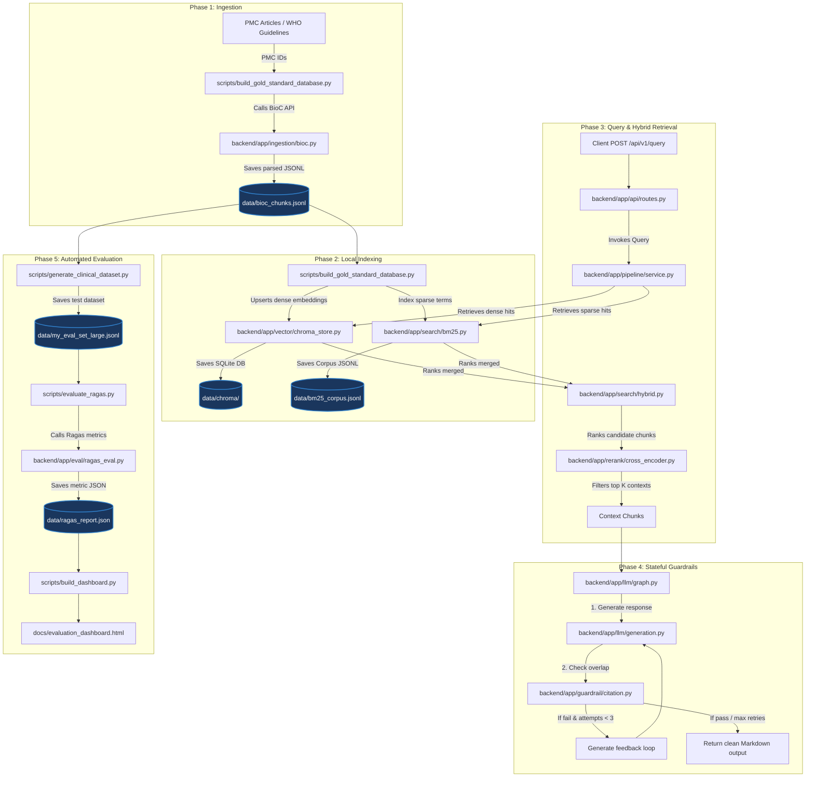

# X-CDS System Architecture & Development Pipeline

This document provides a detailed breakdown of the execution flow in the Explainable Clinical Decision Support System (X-CDS). It details the roles of specific `.py` files during the five main development phases: Ingestion, Indexing, Retrieval, Generation/Guardrails, and Evaluation.

---

## 1. Global Pipeline Flowchart

This flowchart illustrates how data and control pass between your python scripts:

---

## 2. Step-by-Step Technical Execution Flow

### Phase 1: Ingestion Pipeline
1. You run **[build_gold_standard_database.py](file:///d:/X-CDS/scripts/build_gold_standard_database.py)**.
2. The script instantiates the `BioCClient` class from **[bioc.py](file:///d:/X-CDS/backend/app/ingestion/bioc.py)**.
3. For each PMC ID in the script:
   * `BioCClient.fetch_chunks()` sends an HTTP request to the NIH BioC JSON REST API, respecting the NCBI rate limit of 3 requests per second using `RequestRateLimiter`.
   * `parse_bioc_json()` parses the JSON response, structures it into paragraph-level `BiomedicalChunk` objects, and appends them to a list.
4. **[build_gold_standard_database.py](file:///d:/X-CDS/scripts/build_gold_standard_database.py)** merges these chunks with your baseline fixture (`tests/fixtures/bioc_sample.json`) and saves the deduplicated raw passages to `data/bioc_chunks.jsonl`.

### Phase 2: Local Indexing
1. **[build_gold_standard_database.py](file:///d:/X-CDS/scripts/build_gold_standard_database.py)** continues to initialize your search indexing modules.
2. **Dense Indexing (ChromaDB):**
   * The script initializes `ChromaVectorStore` from **[chroma_store.py](file:///d:/X-CDS/backend/app/vector/chroma_store.py)**.
   * `ChromaVectorStore.upsert_chunks()` splits the 6,093 passages into batches of 2,000 to prevent SQLite parameter bind errors.
   * Chunks are sent to `HuggingFaceEmbeddingFunction.embed_documents()` (defined in **[embeddings.py](file:///d:/X-CDS/backend/app/vector/embeddings.py)**), which uses the Hugging Face `BAAI/bge-small-en-v1.5` model to generate 384-dimensional dense vectors.
   * The vectors are saved in the local database collection at `data/chroma/`.
3. **Sparse Indexing (BM25):**
   * The script initializes the `BM25Index` class from **[bm25.py](file:///d:/X-CDS/backend/app/search/bm25.py)**.
   * `BM25Index.index_chunks()` extracts terms, computes frequencies, and indices the raw text using the BM25 algorithm.
   * The index is saved as a persistent corpus JSONL file at `data/bm25_corpus.jsonl`.

### Phase 3: Retrieval & Neural Re-ranking (At Query Time)
1. A clinician enters a query into the React frontend, which sends a POST request to `/api/v1/query`.
2. **[routes.py](file:///d:/X-CDS/backend/app/api/routes.py)** intercepts the request and passes it to the `ClinicalPipelineService` in **[service.py](file:///d:/X-CDS/backend/app/pipeline/service.py)**.
3. The query triggers the **Hybrid Retrieval Pipeline**:
   * **Dense Retrieval:** Calls `ChromaVectorStore.similarity_search()` in **[chroma_store.py](file:///d:/X-CDS/backend/app/vector/chroma_store.py)** to get the top semantic hits.
   * **Sparse Retrieval:** Calls `BM25Index.search()` in **[bm25.py](file:///d:/X-CDS/backend/app/search/bm25.py)** to get keyword matching hits.
4. **Rank Fusion:** The results are passed to `reciprocal_rank_fusion()` in **[hybrid.py](file:///d:/X-CDS/backend/app/search/hybrid.py)**, which computes a unified RRF rank score for each chunk.
5. **Neural Re-ranking:** The merged candidate chunks are passed to the `CrossEncoderReranker` class in **[cross_encoder.py](file:///d:/X-CDS/backend/app/rerank/cross_encoder.py)**. 
   * It runs the query and chunks through a `cross-encoder/ms-marco-MiniLM-L-6-v2` transformer model to produce direct query-chunk relevance scores, filtering down to the top $K$ context passages.

### Phase 4: Stateful Guardrails (LangGraph Workflow)
1. The top $K$ contexts and the query are passed to the LangGraph state machine compiled in **[graph.py](file:///d:/X-CDS/backend/app/llm/graph.py)**.
2. **Generation Node:**
   * `GeminiGenerationNode` invokes `RobustChatVertexAI` (located in **[generation.py](file:///d:/X-CDS/backend/app/llm/generation.py)**).
   * It sends a prompt containing the context passages to `gemini-3.5-flash` via Vertex AI, requesting a markdown response with bracketed source references.
3. **Guardrail Node:**
   * The graph transitions to `CitationGuardrailNode` in **[citation.py](file:///d:/X-CDS/backend/app/guardrail/citation.py)**.
   * The node extracts all bracketed citation marks (e.g. `[1]`) and isolates each cited sentence.
   * `OverlapValidator.validate_citation()` calculates the alphanumeric token-overlap between each generated claim sentence and the text of the cited source chunk.
4. **Correction Feedback Loop:**
   * **If overlap < 0.25 (Fail):** The guardrail node sets `validation_passed = False`, compiles error feedback detailing which claims lacked verbatim overlap, and routes the state back to `GeminiGenerationNode` for a retry.
   * **If overlap >= 0.25 (Pass) or retries exceed 3:** The graph exits the loop and returns the verified answer with citations to the FastAPI server, which returns it to the React frontend.

### Phase 5: Benchmarking & Evaluation (Offline)
1. **Clinical Dataset Generation:**
   * You run **[generate_clinical_dataset.py](file:///d:/X-CDS/scripts/generate_clinical_dataset.py)**.
   * It calls the `ChatGoogleGenerativeAI` wrapper (pointing to `gemini-2.5-pro`) to process random contexts from `data/bioc_chunks.jsonl` and synthesize 100 queries and ground-truth answers in `data/my_eval_set_large.jsonl`.
2. **Ragas Quality Benchmarking:**
   * You run **[evaluate_ragas.py](file:///d:/X-CDS/scripts/evaluate_ragas.py)**.
   * It imports Ragas evaluation functions from **[ragas_eval.py](file:///d:/X-CDS/backend/app/eval/ragas_eval.py)**.
   * The script initializes Ragas metrics wrappers (`faithfulness`, `answer_relevancy`, `context_precision`, and `context_recall`) using `gemini-2.5-pro` (the judge LLM) and `models/text-embedding-004` (the judge embedding model).
   * Ragas evaluates the dataset and writes the scores to `data/ragas_report.json`.
3. **Dashboard Generation:**
   * You run **[build_dashboard.py](file:///d:/X-CDS/scripts/build_dashboard.py)**.
   * It parses the evaluation metrics from `data/ragas_report.json` and compiles them into a visual, interactive HTML dashboard at `docs/evaluation_dashboard.html`.
