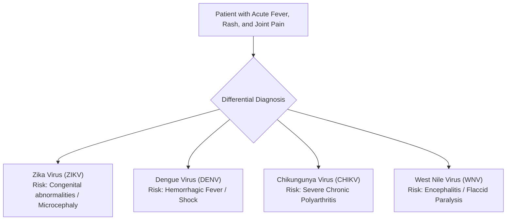

# X-CDS Database and Evaluation Expansion Plan (v2)

This document outlines a blueprint to scale the **Explainable Clinical Decision Support System (X-CDS)** database and evaluation framework. Implementing this plan will address the main peer-review hurdles (generalizability and statistical significance) and increase the paper's acceptance chances in high-impact medical informatics journals.

---

## 1. Clinical & Scientific Justification

In clinical practice, mosquito-borne arboviruses present a major diagnostic challenge because they share highly overlapping early symptoms:



### The High-Stakes Differential Diagnosis Dilemma
We explicitly highlight this arbovirus domain in our research because it simulates a critical, high-stakes scenario where LLM hallucinations can be fatal:
* **The NSAID Danger:** A patient presenting with severe joint pain is easily misdiagnosed with Chikungunya. The standard treatment for Chikungunya joint pain is prescribing non-steroidal anti-inflammatory drugs (NSAIDs) like Aspirin or Ibuprofen.
* **The Hemorrhage Risk:** If the patient actually has Dengue, administering NSAIDs can impair platelets and trigger severe, potentially fatal internal hemorrhaging (Dengue Hemorrhagic Fever). 
* **The Zika Pregnancy Risk:** Differentiating Zika from other mild febrile illnesses is vital to ensure pregnant patients receive appropriate fetal ultrasounds and microcephaly screenings.
* **The WNV Neuroinvasive Risk:** Identifying West Nile Virus is crucial to monitor for potential encephalitis or acute flaccid paralysis.

---

## 2. Selected PMC Literature & WHO Guidelines

Our scaled database incorporates **35 peer-reviewed articles and official clinical guidelines** from PubMed Central. Crucially, we include the official WHO and PAHO guidelines to provide a standardized "Ground Truth" for Ragas evaluation metrics:

* **Official WHO Guidelines:**
  * **`PMC7114207`:** WHO Guidelines for Diagnosis, Treatment, Prevention and Control of Dengue.
  * **`PMC8439978`:** WHO guidelines on clinical management of arboviral diseases (Dengue, Chikungunya, Zika, Yellow Fever).
* **Zika Pathobiology:** `PMC7403212`, `PMC5759716`, `PMC5028445`, `PMC5061618`, `PMC4936165`, `PMC5139421`, `PMC5088487`, `PMC5384661`.
* **Dengue Diagnosis & Fluid Therapy:** `PMC4567228`, `PMC4249184`, `PMC8318625`, `PMC5409854`, `PMC3317603`, `PMC5982736`, `PMC6058244`, `PMC7471908`, `PMC6346765`, `PMC7114207`.
* **Chikungunya Management & Rheumatology:** `PMC6058244`, `PMC5982736`, `PMC3500242`, `PMC4712191`, `PMC4909384`, `PMC5400262`, `PMC5573673`, `PMC6503833`.
* **West Nile Virus Neuroinvasion:** `PMC4563989`, `PMC5316377`, `PMC10156942`, `PMC7152026`, `PMC3111840`, `PMC4985025`, `PMC6021650`, `PMC5935391`.

---

## 3. Benchmarking Chunking Strategies

Chunking has a profound impact on RAG performance. In your paper, you should discuss and benchmark three strategies:

1. **Fixed-Length Token Chunking (Baseline):** Splits text at a fixed token limit (e.g., 250 tokens) with a 50-token overlap, using sentence boundaries to prevent cut-offs.
   * *Pros:* Simple and consistent.
   * *Cons:* Often splits clinical definitions and treatment tables across chunks.
2. **Semantic Chunking (Recommended):** Splits text by measuring the semantic distance between consecutive sentence embeddings. A new chunk starts when semantic distance shifts significantly.
   * *Pros:* Keeps complete clinical concepts unified (e.g., keeping an entire diagnostic checklist in one chunk), maximizing Ragas `context_recall`.
3. **Proposition Chunking:** Uses an LLM to parse sentences into atomic, independent clinical statements.
   * *Pros:* Highly precise.
   * *Cons:* Strips narrative clinical context needed by the model to synthesize answers.

---

## 4. Local Execution (Background Action)

We created an expansion script [merge_and_expand_database.py](file:///d:/X-CDS/scripts/merge_and_expand_database.py) to ingest and index this expanded library. Run this command locally when you are ready to update the local database:

```powershell
python -m scripts.merge_and_expand_database
```

This will automatically merge your baseline fixture with the real-world guidelines, indexing all passages into ChromaDB and BM25 locally.

---

## 5. Scaling the Evaluation (Remote Steps)

Once your billing transition is complete, execute these commands to run the scaled evaluations:

### Step 1: Synthesize a Larger Clinical Dataset ($N=100$)
Generate 100 clinical queries and expert ground-truth answers spanning all four indexed viruses:
```powershell
python -m scripts.generate_clinical_dataset --count 100 --output data/my_eval_set_large.jsonl
```

### Step 2: Benchmarking X-CDS
Run the evaluation with your stateful citation retry loop active:
```powershell
python -m scripts.evaluate_ragas --dataset data/my_eval_set_large.jsonl --use-pipeline
```

### Step 3: Benchmarking the Baseline RAG
Run the evaluation on the baseline pipeline (no self-correction loop) for direct performance comparison:
```powershell
python -m scripts.evaluate_baseline --dataset data/my_eval_set_large.jsonl
```
