# X-CDS Chronological Pipeline Guide (Linear Flow)

This document maps out the entire X-CDS development, runtime, and evaluation pipeline as a linear, step-by-step process. 

---

## 1. Linear Process Flowchart

```mermaid
graph TD
    Step1[1. Ingest Literature:<br>build_gold_standard_database.py pulls PMC API reviews] -->
    Step2[2. Persist Raw Text:<br>Parsed chunks saved to data/bioc_chunks.jsonl] -->
    Step3[3. Build Dense Index:<br>chroma_store.py embeds text via bge-small-en-v1.5] -->
    Step4[4. Build Sparse Index:<br>bm25.py creates corpus index at data/bm25_corpus.jsonl] -->
    Step5[5. Receive Client Query:<br>POST request hits routes.py and invokes service.py] -->
    Step6[6. Fetch Chunks:<br>Dense search + BM25 search merged via hybrid.py RRF] -->
    Step7[7. Re-rank Contexts:<br>cross_encoder.py filters top K relevant passages] -->
    Step8[8. LLM Generation:<br>generation.py queries gemini-3.5-flash in graph.py] -->
    Step9[9. Citation Check:<br>citation.py calculates verbatim token overlap >= 25%] -->
    Step10[10. Stateful Retries:<br>Incorrect claims trigger graph feedback loops up to 3 times] -->
    Step11[11. Return Final Response:<br>Explainable answer returned to FastAPI & React UI] -->
    Step12[12. Build Test Dataset:<br>generate_clinical_dataset.py synthesizes 100 cases] -->
    Step13[13. Run Benchmarks:<br>evaluate_ragas.py scores pipeline metrics via gemini-2.5-pro] -->
    Step14[14. Compile Dashboard:<br>build_dashboard.py compiles docs/evaluation_dashboard.html]

    style Step1 fill:#f9f,stroke:#333,stroke-width:2px
    style Step4 fill:#bbf,stroke:#333,stroke-width:2px
    style Step5 fill:#dfd,stroke:#333,stroke-width:2px
    style Step8 fill:#fdd,stroke:#333,stroke-width:2px
    style Step11 fill:#dfd,stroke:#333,stroke-width:2px
    style Step12 fill:#ffd,stroke:#333,stroke-width:2px
```

---

## 2. Step-by-Step Chronological Details

### Step 1: Ingest Literature
* **File:** [build_gold_standard_database.py](file:///d:/X-CDS/scripts/build_gold_standard_database.py)
* **What it does:** Triggers the ingestion. It queries the NIH PMC API for 50 specified clinical papers and official WHO guidelines using the client defined in **[bioc.py](file:///d:/X-CDS/backend/app/ingestion/bioc.py)**.

### Step 2: Persist Raw Text
* **File:** [bioc_chunks.jsonl](file:///d:/X-CDS/data/bioc_chunks.jsonl)
* **What it does:** The client parses the XML/JSON response from the PMC API, normalizes the text into document passages, and saves the 6,093 unique chunks into this central text file.

### Step 3: Build Dense Index
* **File:** [chroma_store.py](file:///d:/X-CDS/backend/app/vector/chroma_store.py)
* **What it does:** Reads the raw JSONL chunks, groups them into batches of 2,000 to prevent SQLite errors, embeds them using `BAAI/bge-small-en-v1.5` in **[embeddings.py](file:///d:/X-CDS/backend/app/vector/embeddings.py)**, and saves them to the local Chroma collection at `data/chroma/`.

### Step 4: Build Sparse Index
* **File:** [bm25.py](file:///d:/X-CDS/backend/app/search/bm25.py)
* **What it does:** Indexes terms from the raw text for keyword search matching and saves the persistent lexical database to `data/bm25_corpus.jsonl`.

### Step 5: Receive Client Query
* **File:** [routes.py](file:///d:/X-CDS/backend/app/api/routes.py)
* **What it does:** Listens for a POST request on the `/api/v1/query` endpoint containing the user's clinical symptoms and forwards the query string to the backend orchestrator service.

### Step 6: Fetch Chunks
* **File:** [hybrid.py](file:///d:/X-CDS/backend/app/search/hybrid.py)
* **What it does:** Performs parallel dense vector search (via Chroma) and sparse lexical search (via BM25) and merges the rankings using Reciprocal Rank Fusion (RRF).

### Step 7: Re-rank Contexts
* **File:** [cross_encoder.py](file:///d:/X-CDS/backend/app/rerank/cross_encoder.py)
* **What it does:** Feeds the top RRF candidate passages to the `cross-encoder/ms-marco-MiniLM-L-6-v2` re-ranking model to score their direct contextual relevance, narrowing the selection down to the top $K$ context chunks.

### Step 8: LLM Generation
* **File:** [generation.py](file:///d:/X-CDS/backend/app/llm/generation.py)
* **What it does:** Inside the LangGraph workflow compiled in **[graph.py](file:///d:/X-CDS/backend/app/llm/graph.py)**, the generation node prompts `gemini-3.5-flash` using the $K$ re-ranked context passages to generate a clinical response containing bracketed citation markers.

### Step 9: Citation Check
* **File:** [citation.py](file:///d:/X-CDS/backend/app/guardrail/citation.py)
* **What it does:** The LangGraph guardrail node parses the generated markdown, identifies each cited sentence, and calculates its verbatim token-overlap with the referenced database text.

### Step 10: Stateful Retries
* **File:** [graph.py](file:///d:/X-CDS/backend/app/llm/graph.py)
* **What it does:** If any cited sentence has less than $25\%$ verbatim overlap with the source, the graph routes the execution state back to the generator node with an error log. The generator attempts to write a corrected response (up to 3 times).

### Step 11: Return Final Response
* **File:** [service.py](file:///d:/X-CDS/backend/app/pipeline/service.py)
* **What it does:** Once the response passes the guardrail (or reaches the retry limit), the FastAPI server returns the finalized, explainable markdown answer to the React client interface.

### Step 12: Build Test Dataset
* **File:** [generate_clinical_dataset.py](file:///d:/X-CDS/scripts/generate_clinical_dataset.py)
* **What it does:** (Offline Step) Prompts `gemini-2.5-pro` to parse random blocks of your 6,093 indexed passages and synthesize 100 clinical queries and verified ground-truth answers. Saves them to `data/my_eval_set_large.jsonl`.

### Step 13: Run Benchmarks
* **File:** [evaluate_ragas.py](file:///d:/X-CDS/scripts/evaluate_ragas.py)
* **What it does:** Passes the synthesized dataset to the Ragas evaluator configured in **[ragas_eval.py](file:///d:/X-CDS/backend/app/eval/ragas_eval.py)**, which uses `gemini-2.5-pro` as the judge to grade Faithfulness, Relevancy, Precision, and Recall. Saves scores to `data/ragas_report.json`.

### Step 14: Compile Dashboard
* **File:** [build_dashboard.py](file:///d:/X-CDS/scripts/build_dashboard.py)
* **What it does:** Reads the evaluation report and compiles the final interactive HTML results dashboard at `docs/evaluation_dashboard.html` for presentation.
